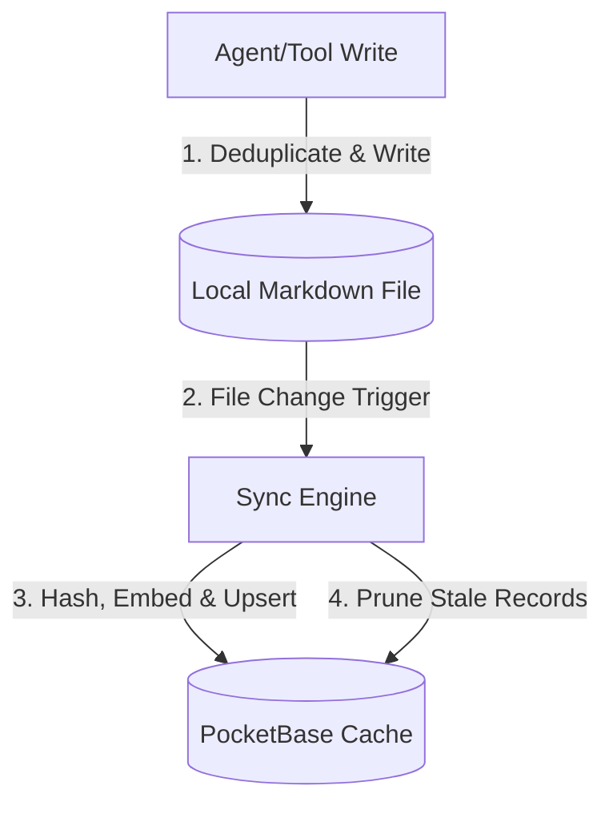
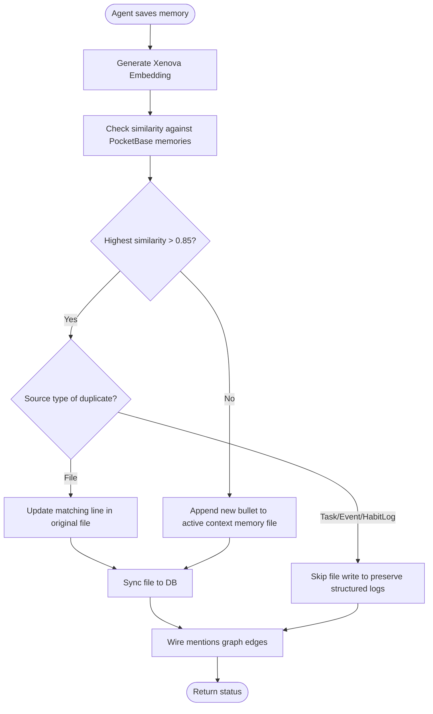

# Memory System Architecture: File-First Semantic Memories

This document outlines the design and implementation of Dialogue's **file-first semantic memory system**. Consistent with Dialogue's architecture, the filesystem is the source of truth, while the database acts as a performant cache and search index.

---

## 1. Overview & Core Philosophy

Rather than storing user-profile knowledge (preferences, biographical facts, general rules) directly inside a database, Dialogue stores them as **bulleted Markdown lists** in local files.

- **Filesystem Authority**: User facts exist on disk, meaning they remain accessible, human-readable, and portable even outside Dialogue.
- **PocketBase Cache**: PocketBase caches these facts along with computed vector embeddings for fast semantic lookup.
- **Local Vectors**: Xenova local model generates `384-dimensional` L2-normalized embeddings, keeping all retrieval operations private and offline.

---

## 2. File Layout & Path Resolution

Memories are scoped either globally or to a specific workspace, depending on the active context:

| Context Scope | File Path relative to Folio Root | Entity ID | Workspace ID |
| :--- | :--- | :--- | :--- |
| **Global Scope** | `system/memories.md` | `global` | `null` |
| **Workspace Scope (New)** | `workspaces/[slug]-[workspaceId]/workspace_memories.md` | `[workspaceId]` | `[workspaceId]` |
| **Workspace Scope (Legacy)** | `[workspaceId]/workspace_memories.md` | `[workspaceId]` | `[workspaceId]` |

### Path Resolver Integration
The sync engine resolves these paths via [resolveEntityFromPath](file:///d:/Project%20Hub/Dialogue-AI/src/lib/folio/sync.ts#L36-L81), mapping them to the `memories` collection:
- `system/memories.md` ──> `{ id: "global", collectionName: "memories", workspaceId: null }`
- `workspaces/[slug]-[workspaceId]/workspace_memories.md` ──> `{ id: workspaceId, collectionName: "memories", workspaceId: workspaceId }`
- `[workspaceId]/workspace_memories.md` ──> `{ id: workspaceId, collectionName: "memories", workspaceId: workspaceId }`

---

## 3. Synchronization Pipeline & Database Caching

When a memories file is parsed, the sync engine ensures the database cache is perfectly aligned:

1. **Bullet Point Parsing**: The engine reads the file's body and extracts lines starting with `- ` or `* `.
2. **Hashing**: For each bullet point, a SHA-256 hash is computed.
3. **Local Embedding**: A local 384d embedding is computed for new/updated bullets.
4. **PocketBase Upsert**: The bullet is stored with:
   - `source_type`: `"File"`
   - `source_id`: Relative path to the Markdown file
   - `hash`: SHA-256 hash (used as a unique key to prevent redundant writes)
   - `embedding`: Vector data
5. **Pruning**: Any database record matching the `source_id` whose hash is **no longer present** in the file is automatically deleted.

### Background & Inline Syncing
- **Background Sync**: File changes are detected by the folder watcher and synced via `POST /api/sync`.
- **Inline Sync**: When the agent modifies a memories file, it calls `syncFolioFileToDb` synchronously in-process to guarantee zero-latency cache updates before the next turn.

---

## 4. Agent Write Path & Semantic Deduplication

To keep Markdown files clean of redundant bullets, the `saveSemanticMemory` tool employs a `0.85` cosine similarity check:

- **File Source Update**: If a duplicate resides in a `File` source, the matching line in that file is replaced with the new text. The file is then synced, which automatically updates the database cache (pruning the old hash and creating the new one).
- **Structured Source Protection**: If the duplicate resides in a task or event note, no file is edited to avoid corrupting structured logs. The tool returns `skipped_duplicate`.
- **Relationship Wiring**: Regardless of whether a new memory is appended, updated, or skipped, the tool wires mentions edges (e.g. `MENTIONS_TASK`) to the final memory record ID.

---

## 5. Graph Relationships (Mentions Edges)

Dialogue links semantic memories to other entities (Tasks, Events, Habits) via the `graph_edges` collection:
- `edge_type` is one of: `MENTIONS_TASK`, `MENTIONS_EVENT`, `MENTIONS_HABIT`.
- Targets must be verified: `wireMentionsEdges` verifies that the target ID exists in the database before creating the edge to avoid stale references.
