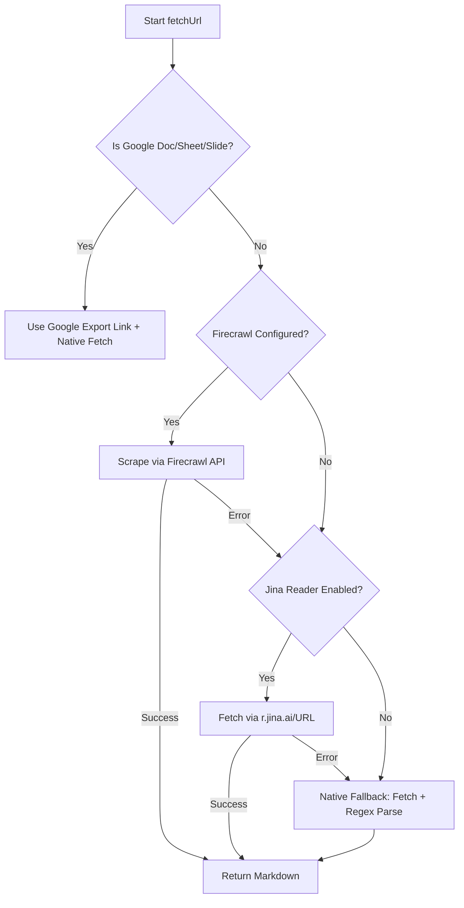

# Web Scraping Architecture (Firecrawl & Jina Reader Integration)

## Problem

The current implementation of the `fetchUrl` tool is a naive HTTP `fetch` followed by regex-based cleaning to strip HTML tags (found in [ai_action.ts](file:///d:/Project%20Hub/Dialogue-AI/convex/ai_action.ts) and [lmstudio.ts](file:///d:/Project%20Hub/Dialogue-AI/src/lib/lmstudio.ts)). 

This approach has major limitations:
1. **Dynamic Content Fails**: It cannot execute client-side JavaScript, meaning Single Page Applications (React, Next.js, Vue, Angular, etc.) return empty or incomplete text.
2. **Aggressive Bot Protection**: Standard requests are instantly blocked by Cloudflare, Akamai, or captcha protections on many modern web platforms.
3. **Lacks Semantic Structure**: Raw regex tag-stripping destroys structural formatting. Returning unformatted wall-of-text content to the LLM reduces prompt clarity and increases token waste compared to clean Markdown.

---

## Target: Fallback-Driven Scraper Engine

To address this, Dialogue-AI will support a configurable, fallback-driven scraping engine that supports **Firecrawl** (cloud or self-hosted) and **Jina Reader** (zero-config public API), while retaining a local native fallback for safety.



### Environment Configuration (`.env.local`)

Users can customize the scraping behavior using standard environment variables:

```bash
# Web Scraping Configuration
# Options: "firecrawl" | "jina" | "native" (defaults to "firecrawl" if key present, otherwise "jina")
SCRAPER_ENGINE="firecrawl"

# Firecrawl Configuration (Managed Cloud or Local Docker)
FIRECRAWL_API_KEY="fc-xxxxxx"
FIRECRAWL_API_URL="http://localhost:3002" # Set for self-hosted local docker instance

# Jina Reader Configuration (Optional API Key to increase rate limits)
JINA_API_KEY="jina_xxxxxx"
```

---

## Scraper Engines

### 1. Firecrawl (Highest Fidelity & Self-Hostable)
* **Endpoint**: `POST ${FIRECRAWL_API_URL}/v1/scrape`
* **Headers**: `Authorization: Bearer ${FIRECRAWL_API_KEY}`
* **Payload**:
  ```json
  {
    "url": "target_url",
    "formats": ["markdown"]
  }
  ```
* **Pros**: Handles dynamic rendering, CAPTCHAs, proxy rotation, and returns clean Markdown. Can be fully self-hosted locally via Docker Compose for privacy.

### 2. Jina Reader (Zero-Configuration Cloud Option)
* **Endpoint**: `GET https://r.jina.ai/${target_url}`
* **Headers**: `Authorization: Bearer ${JINA_API_KEY}` (optional)
* **Pros**: No complex setup or API key required to get started. Great default out-of-the-box experience.

### 3. Native Fetch (Local Safety Fallback)
* **Behavior**: Standard Node.js `fetch` + existing regex-based HTML/PDF parser.
* **Role**: Handles special Google Document export links, or acts as a final fail-safe for offline/local network endpoints.

---

## Files to Modify

| File | Change |
|---|---|
| [convex/ai_action.ts](file:///d:/Project%20Hub/Dialogue-AI/convex/ai_action.ts) | Update `fetchUrl` tool action to support routing config, calling Firecrawl/Jina API, and handling fallbacks. |
| [src/lib/lmstudio.ts](file:///d:/Project%20Hub/Dialogue-AI/src/lib/lmstudio.ts) | Update local `fetchUrl` handling to match the exact same multi-engine fallback behavior. |
| [README.md](file:///d:/Project%20Hub/Dialogue-AI/README.md) | Update documentation to explain scraping engine options and environment setup. |
| `.env.example` | Document scraper environment variables (`SCRAPER_ENGINE`, `FIRECRAWL_API_KEY`, etc.). |

---

## Timeline & Implementation Strategy

1. **Robust Config Reader**: Create a helper parser that cleanly reads the active scraper preference based on environment variables.
2. **Unified Action Tool**: Update `convex/ai_action.ts` first, implementing timeout guards (15s limits) so failing external scrapers fail quickly and cascade cleanly to the next fallback.
3. **Local Replicator**: Sync the implementation into `src/lib/lmstudio.ts` for local offline models.
