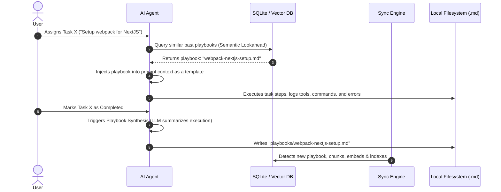

# Self-Improving Task Playbooks & Agentic Execution Synthesis

This document outlines the proposed architecture for **Self-Improving Task Playbooks** in Dialogue. The goal is to enable the agent to learn over time from its own execution history: when the agent performs a complex, multi-step task, it automatically synthesizes its notes, conversational context, tool executions, errors, and successful configurations into a reusable "Playbook" (Markdown file) that is vectorized and retrieved as a template when a similar task is encountered in the future.

---

## 1. Architectural Overview

The Playbook system operates as a closed-loop execution-and-synthesis cycle:



---

## 2. Core Components

### A. Execution Tracer (Tool & CLI Interceptor)
While the agent is actively executing a task, the system maintains a transient runtime log of its actions. This includes:
*   **Tool Calls**: Every tool called (e.g., `write_to_file`, `run_command`, `fetchUrl`), its arguments, and its return values.
*   **CLI Inputs/Outputs**: Terminal commands run, outputs returned, and whether they succeeded or failed.
*   **Compilation / Runtime Errors**: Captured stack traces, missing dependency warnings, and lint errors.
*   **User Feedback**: Chat messages exchanged during the lifetime of the task, containing corrections, preferences, and validations.

### B. Post-Task Synthesis Engine
When a task's status transitions to `completed` (marked by the user or verified by the agent), a background synthesis pipeline is invoked.
The system feeds the following raw ingredients into a specialized LLM prompt:
1.  **Original Task Metadata**: Title, description, priority, and category.
2.  **Conversational Transcript**: Messages in the chat session that had the active task pinned or mentioned.
3.  **Task Notes**: Date-timestamped entries added during execution (e.g., via `appendTaskNotes`).
4.  **Raw Execution Trace**: The successful CLI commands, file paths modified, and key errors encountered.

The LLM is instructed to output a structured **Playbook Document** in markdown format.

### C. Playbook Filesystem Format
Playbooks are stored as physical `.md` files under the workspace's `playbooks/` folder (e.g., `folio/workspaces/Startup-Project/playbooks/`). This fits the local-first filesystem folio philosophy.

#### Playbook Template Structure:
```markdown
---
id: pb-nextjs-webpack-setup
title: "Next.js Custom Webpack Configuration"
category: "DevOps / Bundler"
original_task_id: task-789
success_rate: 1.0
tags: [nextjs, webpack, bundler, tailwind]
last_verified: 2026-06-09
---

# Next.js Custom Webpack Configuration Playbook

## 1. Goal & Context
The user wanted to set up a custom Webpack configuration in Next.js to externalize large packages and resolve origin CORS checks for Electron localhost connections.

## 2. Proven Execution Roadmap
Step-by-step actions that successfully achieved the goal:
1. Identify `next.config.js` or `next.config.mjs` in the project root.
2. Inject a custom `webpack` hook in the configuration.
3. Example configuration:
   ```javascript
   // next.config.mjs
   /** @type {import('next').NextConfig} */
   const nextConfig = {
     webpack: (config, { isServer }) => {
       if (!isServer) {
         config.resolve.fallback = { fs: false };
       }
       return config;
     },
   };
   export default nextConfig;
   ```
4. Run `npm run dev` to verify the build process compiles without issues.

## 3. Troubleshooting & Error Logs
Issues encountered and how they were solved:
* **Error**: `Module not found: Can't resolve 'fs'`
  * **Root Cause**: Node.js core modules being imported in client-side bundles.
  * **Solution**: Add the `fallback: { fs: false }` resolution rule to client Webpack config as shown above.
* **Error**: `cors origin blocked`
  * **Root Cause**: Next.js server rejecting origin requests from Electron's custom protocol `http://localhost:3000`.
  * **Solution**: Update Next.js backend headers/middleware to allow `http://localhost:3000` as an allowed origin.
```

### D. Semantic Lookahead & In-Context Execution
When a new task is created:
1.  **Vector Search**: The system chunks the new task description and queries the `memories` table (filtered by `source_type = "Playbook"`).
2.  **Relevance Filtering**: If a playbook matches with a similarity score above a defined threshold, it is retrieved.
3.  **Template Injection**: The retrieved playbook is injected into the Agent's system prompt inside a dedicated section:
    ```text
    ## Past Execution Playbooks
    You have performed similar tasks successfully in the past. Below is the playbook generated from your previous execution. Follow this roadmap and apply these lessons to complete the current task:
    ---
    [PLAYBOOK CONTENT HERE]
    ---
    ```
4.  **Execution and Update**: The agent follows the playbook. If it runs into new edge cases or executes a new command, these updates are captured in the active trace, and the playbook is updated/versioned upon completion.

---

## 3. Core Benefits & Growth Over Time

*   **Day 30 vs. Day 1**: On Day 1, the agent operates entirely on its base training data, making standard assumptions. By Day 30, the agent has a repository of custom playbooks tailored to the user's specific development environment, tech stack, preferences, and hardware configs.
*   **Reduced Token Usage & Redundant Steps**: The agent doesn't waste time running diagnostic commands (e.g. checking node versions, exploring file structures) that it already documented in previous playbooks.
*   **Auditable & Curatable Learning**: Because playbooks are local Markdown files, the user has complete control over what the agent learns. If the user dislikes how the agent solved a problem, they can open the playbook `.md` file, rewrite the steps, or delete the file entirely. The sync engine will automatically re-index it.

---

## 4. Key Design Decisions & Future Work

1.  **Granularity of Tracing**: Logging *every single keystroke* or command output would blow up the context window. The Execution Tracer should prioritize **command names, exit codes, and diff summaries** instead of raw shell outputs, keeping the input context for the Synthesis LLM compact.
2.  **Cross-Workspace Playbooks**: Some playbooks (e.g. standard React patterns, Git operations) are globally applicable. They should be stored in a global `playbooks/` folder, while project-specific playbooks remain inside their isolated workspace folder.
3.  **Playbook Evolutionary Merge**: If the agent performs the same task multiple times, it should not create duplicate playbooks. Instead, the synthesis hook should check if a playbook already exists and **merge/refine** it, increasing its `success_rate` metric and appending new troubleshooting edge-cases.
