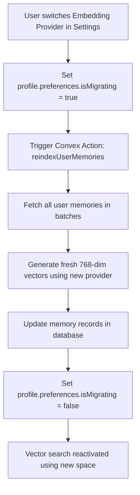

# Spec: Hot-Swappable Semantic Embeddings & Re-Indexing Pipeline

This document outlines the design and implementation plan for upgrading Dialogue's semantic memory architecture to support hot-swappable embedding providers (Google Gemini, OpenAI, and Local LLMs) while preserving vector-search integrity.

---

## 1. Architectural Challenge
Dialogue's long-term memory relies on Convex's vector search index:
```typescript
// convex/schema.ts
memories: defineTable({
  userId: v.id("users"),
  text: v.string(),
  embedding: v.array(v.number()), // Constrained to 768 dimensions
}).vectorIndex("by_embedding", {
  vectorField: "embedding",
  dimensions: 768,
})
```
Since vector indexes require a fixed dimensionality, any swappable embedding model must output exactly **768 dimensions**. If a user switches their embedding provider, their existing stored memory vectors (e.g., embedded via Gemini) will become mathematically incompatible with new queries generated via the new provider (e.g., OpenAI).

---

## 2. Solution Blueprint



### Key Components

1. **Dimension Calibration**:
   * **Gemini**: Natively uses `text-embedding-004` (768 dimensions).
   * **OpenAI**: Uses `text-embedding-3-small` or `text-embedding-3-large`, passing the `dimensions: 768` parameter.
   * **Local (Ollama/LM Studio)**: Uses `nomic-embed-text` or similar local model (768 dimensions).
2. **Re-Indexing Migration**:
   * Introduces an `isMigrating` flag on the user profile to temporarily route memory queries to simple chronological search while re-indexing occurs.
   * Runs a batched background action that regenerates vector arrays for all memories.

---

## 3. Implementation Steps

### Step 1: Extend User Schema & Settings
Update `userProfile` preferences to store the active embedding provider and migration states.

```typescript
// Proposed additions to settings page & DB schema
type EmbeddingProvider = "gemini" | "openai" | "local";

interface UserPreferences {
  provider: AIProvider;
  embeddingProvider: EmbeddingProvider; // NEW
  isMigratingEmbeddings?: boolean;       // NEW
  customConfigs: Record<string, {
    apiKey?: string;
    baseUrl?: string;
    modelId?: string;
    embeddingModelId?: string; // NEW (e.g. text-embedding-3-small)
  }>;
}
```

### Step 2: Implement Multi-Provider Embedding Generator
Create a unified utility to generate 768-dimensional vectors from text:

```typescript
// convex/embeddings.ts
import { OpenAI } from "openai";
import { GoogleGenerativeAI } from "@google/generative-ai";

interface EmbedOptions {
  text: string;
  provider: "gemini" | "openai" | "local";
  config: { apiKey?: string; baseUrl?: string; modelId?: string };
}

export async function generateEmbedding(options: EmbedOptions): Promise<number[]> {
  const { text, provider, config } = options;
  const apiKey = config.apiKey || "";

  if (provider === "openai") {
    const openai = new OpenAI({ apiKey, baseURL: config.baseUrl });
    const response = await openai.embeddings.create({
      model: config.modelId || "text-embedding-3-small",
      input: text,
      dimensions: 768, // Shorten OpenAI's native dimensions to match Convex index
    });
    return response.data[0].embedding;
  } 
  
  if (provider === "local") {
    // Local Ollama / LM Studio embedding endpoint
    const response = await fetch(`${config.baseUrl || "http://localhost:11434"}/api/embeddings`, {
      method: "POST",
      body: JSON.stringify({
        model: config.modelId || "nomic-embed-text",
        prompt: text
      })
    });
    const data = await response.json();
    return data.embedding; // Ensure model outputs 768 dimensions
  }

  // Fallback to Gemini text-embedding-004
  const genAI = new GoogleGenerativeAI(apiKey || process.env.GEMINI_API_KEY || "");
  const model = genAI.getGenerativeModel({ model: config.modelId || "text-embedding-004" });
  const result = await model.embedContent(text);
  return result.embedding.values;
}
```

### Step 3: Write Batched Re-indexing Action
Create a resilient background migration function:

```typescript
// convex/migrations.ts
import { action, mutation } from "./_generated/server";
import { api } from "./_generated/api";
import { v } from "convex/values";

export const reindexUserMemoriesAction = action({
  args: { userId: v.id("users"), targetProvider: v.string() },
  handler: async (ctx, args) => {
    // 1. Set migration lock in DB
    await ctx.runMutation(api.migrations.setMigrationStatus, { userId: args.userId, isMigrating: true });

    try {
      // 2. Fetch all user memories
      const memories = await ctx.runQuery(api.migrations.getUserMemories, { userId: args.userId });
      const profile = await ctx.runQuery(api.ai.getProfile, { userId: args.userId });
      const customConfigs = profile?.preferences?.customConfigs || {};
      const config = customConfigs[args.targetProvider] || {};

      // 3. Batched re-embedding
      const batchSize = 10;
      for (let i = 0; i < memories.length; i += batchSize) {
        const batch = memories.slice(i, i + batchSize);
        await Promise.all(batch.map(async (memory) => {
          const newVector = await generateEmbedding({
            text: memory.text,
            provider: args.targetProvider as any,
            config
          });
          await ctx.runMutation(api.migrations.updateMemoryEmbedding, {
            memoryId: memory._id,
            embedding: newVector
          });
        }));
      }
    } catch (error) {
      console.error("Migration failed:", error);
    } finally {
      // 4. Release migration lock
      await ctx.runMutation(api.migrations.setMigrationStatus, { userId: args.userId, isMigrating: false });
    }
  }
});
```

---

## 4. UI Settings Mockup Integration
In **Intelligence** tab under settings, present:
1. **Embedding Provider Selector**: Select between Gemini (Default), OpenAI, and Local.
2. **Dynamic Warn Indicator**: On changing selection, prompt a warning:
   > ⚠️ **Vector Space Re-alignment Required**: Switching your embedding provider requires re-indexing your existing memories. Dialogue will re-index your memories in the background (approx. 5-10 seconds).
3. **Migration Progress Indicator**: Show a loader while `isMigratingEmbeddings` is true.
