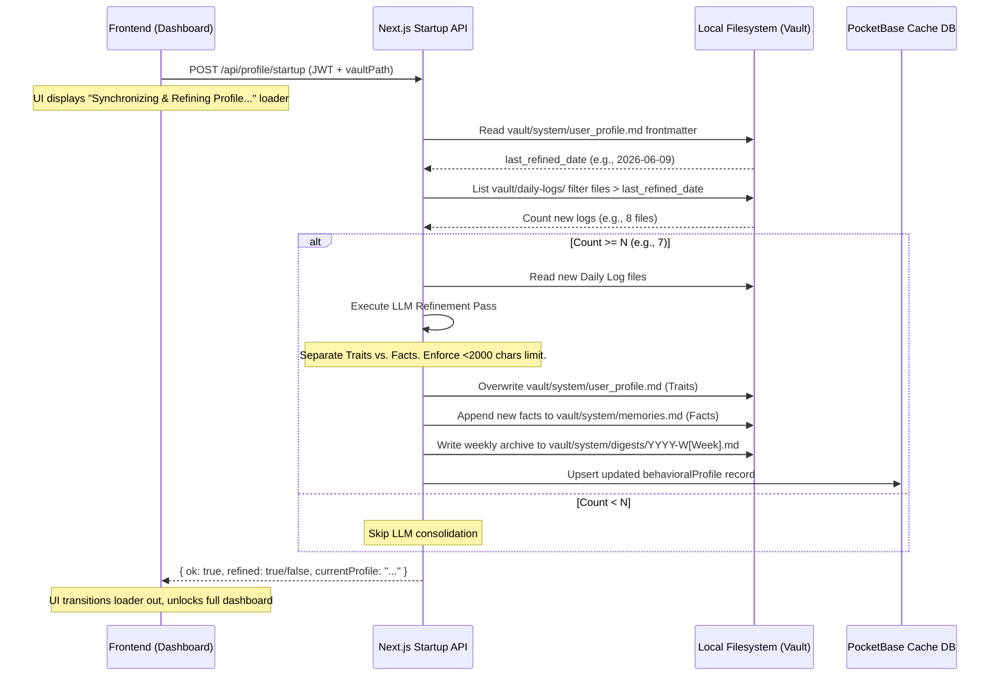

# Unified Memory & Profile Synthesis Architecture

This document defines the unified memory engine and context consolidation architecture for Dialogue. It details how the system splits static knowledge from behavioral instructions, manages the filesystem-backed memory stores, runs app-start consolidation, and integrates the dual-graph retrieval model (logical SQLite walker + semantic Mastra GraphRAG).

---

## 1. Core Concept: The Memory Split

To ensure the agent behaves consistently, avoids context window bloat, and preserves user privacy, Dialogue splits memory into two distinct operational layers:

```
                            ┌────────────────────────────────────────┐
                            │          Your Markdown Vault           │
                            │      (Tasks, Events, Habits, Notes)    │
                            └───────────────────┬────────────────────┘
                                                │
                                                ▼ (Sync Engine watch)
                            ┌────────────────────────────────────────┐
                            │        PocketBase Database Cache       │
                            └─────────┬────────────────────┬─────────┘
                                      │                    │
          ┌───────────────────────────┘                    └───────────────────────────┐
          ▼ (Behavioral Profile)                                                       ▼ (Declarative Memory)
  ┌───────────────────────────────┐                                            ┌───────────────────────────────┐
  │        user_profile.md        │                                            │          memories.md          │
  ├───────────────────────────────┤                                            ├───────────────────────────────┤
  │ • Scope: Traits & Instructions│                                            │ • Scope: Static Facts & RAG   │
  │ • Loaded: Always on boot      │                                            │ • Loaded: Dynamically via RAG │
  │ • Limit: Strict 2,000 chars   │                                            │ • Limit: Scalable (no cap)    │
  │ • Ingestion: App-start LLM    │                                            │ • Ingestion: Real-time sync / │
  │   refinement from Daily Logs  │                                            │   tool calls / LLM delegation │
  └───────────────────────────────┘                                            └───────────────────────────────┘
```

### A. Behavioral Profile (`vault/system/user_profile.md`)
*   **Role**: Stores instructions, cognitive preferences, communication styles, and scheduling directives.
*   **Retrieval**: Always loaded directly into the system instructions on session startup to shape the agent's core personality and behavior.
*   **App Start Refinement**: Refined dynamically on app start by analyzing the past $N$ daily logs.
*   **Strict Character Limit**: Capped at **2,000 characters** (maximum 7 items). The refinement LLM is instructed to consolidate, rewrite, and prune traits to maintain the character cap, preventing system prompt bloat.

### B. Declarative Memory (`vault/system/memories.md`)
*   **Role**: Stores explicit factual knowledge (hobbies, project contexts, relationship links, name records).
*   **Retrieval**: Loaded dynamically into the conversation via Vector/Graph search (RAG) *only when relevant*.
*   **Archiving**: Scalable list of facts with no strict character cap, managed via vector embeddings.

> [!NOTE]
> **Deprecation of OCEAN**: Traditional psychometric scoring (OCEAN profiles) is deprecated in favor of this behavioral profile and Daily Log timeline synthesis.

---

## 2. The 3rd-Person Watcher Agent & Cognitive Ingestion Pipeline

To prevent prompt bloat and reduce cognitive overhead on the primary conversational companion, Dialogue uses a dedicated **3rd-Person Watcher Agent** that operates above the conversation loop. 

The Watcher Agent is configured using the user's preferred task model (configured in Settings) and performs two crucial roles per turn:

1. **Proactive Retrieval (Pre-Turn)**: Before the primary agent generates a response, the Watcher reads the latest user message and conversation context. It decides if historical memories or user profile traits are needed, formulates targeted vector/graph queries, and injects relevant context. This prevents passive, keyword-only RAG.
2. **Real-time Ingestion (Post-Turn)**: Once a conversation turn completes, the Watcher runs in the background. It extracts any new user facts to write to `memories.md` (checking for contradictions/overrides) and writes **Raw Behavioral Clues** directly to the current day's log file on disk.

```
       ┌────────────────────────┐
       │          User          │
       └───────────┬────────────┘
                   │
                   ▼ (1. Message Sent)
       ┌────────────────────────┐
       │   3rd Person Watcher   │ ◄───[Vector RAG / memories.md]
       └───────────┬────────────┘
                   │ (2. Proactive memory injection & context prep)
                   ▼
       ┌────────────────────────┐
       │     Primary Agent      │
       └───────────┬────────────┘
                   │ (3. Conversational Response)
                   ▼
       ┌────────────────────────┐
       │          User          │
       └───────────┬────────────┘
                   │
                   ▼ (4. Turn completes)
       ┌────────────────────────┐
       │   3rd Person Watcher   │ ───► [Saves new semantic memories]
       └────────────────────────┘ ───► [Writes raw behavior clues in real time]
```

---

## 3. Daily Log Structure & Refinement Pipeline

Dialogue replaces abstract personality indexing with a concrete timeline of habits, reflections, and raw behavioral clues.

### A. Divided Daily Log Structure
The daily log has **no character limit** and scales dynamically based on the day's activity level. It is split into two specialized files:

1.  **Global Daily Log (`vault/daily-logs/YYYY-MM-DD.md`)**: Captures personal journal entries, habits, completed global tasks, events, and raw behavioral observations of the day.
2.  **Workspace Activity Log (`vault/workspaces/[Workspace-Name]/activity/YYYY-MM-DD.md`)**: Tracks technical work logs, tool execution traces, playbooks, and tasks specific to that workspace.

#### Global Daily Log Format (`vault/daily-logs/YYYY-MM-DD.md`)
```markdown
---
date: YYYY-MM-DD
type: daily-log
last_modified: TIMESTAMP
---

# Daily Log - YYYY-MM-DD

## Today's Habits
- [x] Meditation
- [ ] Workout (Skipped: rain)

## Raw Behavioral Clues & Observations
*Written in real-time by the Watcher Agent:*
- User began deep-work debugging task-123 at 23:45. Showed high stamina but noted fatigue towards 01:15.
- Expressed preference for minimal explanations; rejected suggestions for architectural rewrites.

## Chat Activity & Reflected Thoughts
- **Global (Session: 'Life Goals')**: Chatted about long-term productivity plans.

## Tasks Completed
- [x] task-456: Buy groceries (Completed: 18:15)

## Events & Outcomes
- [x] event-789: Weekly Team Sync (Time: 10:00 - 10:45)
```

### B. Refinement Pipeline (Weekly Refinement)
The **Reflector Agent** refines the user's behavioral profile on a deterministic schedule:

1.  **Configurable Threshold ($N$)**: The user defines a preference parameter, $N$ (defaulting to `7` daily logs).
2.  **App Start Catch-up**: When Dialogue boots, if the current calendar date has changed since the last recorded activity, the Reflector counts new daily logs since the last refinement.
3.  **Refinement Run**: If $\text{count} \ge N$:
    *   The Reflector runs a pattern analysis pass over the $N$ new daily logs (analyzing the `Raw Behavioral Clues` sections for tendencies/traits).
    *   **Writes Active Profile (`user_profile.md`)**: It overwrites `vault/system/user_profile.md` with the updated N-Line Startup Profile under a strict 2,000-character limit.
    *   **Delegates Facts**: Static facts (e.g. tech stacks, hobbies) are extracted and written to `vault/system/memories.md` instead.
    *   **Archives Digest**: It compiles a weekly Markdown digest under `vault/system/digests/YYYY-W[Week].md`.

#### Startup Catch-up Flow Sequence
The startup check and consolidation sequence runs during Next.js app initialization:



---

## 3. Transparent & Auditable Declarative Memory

Because the source of truth for declarative memory is a physical Markdown file on the user's disk (`vault/system/memories.md`), the user has total visibility and control:

*   **Deletion**: If the user wants the agent to "forget" a fact, they open `memories.md` and delete the corresponding bullet point. The file watcher detects the delete and removes the embedding from the database cache.
*   **Correction**: If the agent makes a false assumption, the user edits the line in `memories.md`, and the agent's memory updates instantly.

### A. Memory Scopes
1.  **Unified (Workspace-Agnostic) Memories (`vault/system/memories.md`)**: Global profile facts, interpersonal preferences, and communication style, accessible in any conversation.
2.  **Specialized (Workspace-Specific) Memories (`vault/workspaces/[Workspace-Name]/workspace_memories.md`)**: Technical details, project constraints, client relationships, or credentials relevant only to that workspace.
    *   When working within a specific workspace, the agent loads **both** the Unified memories and the workspace's Specialized memories.
    *   If no workspace is active (general chat), specialized memories are completely isolated.

### B. Conversational Memory Modification (On-the-Fly Directives)
In addition to the background Watcher Agent's silent observations and manual filesystem editing, the user must be able to explicitly command the companion to update its knowledge base in real time (e.g., *"Remember that my sister's dog is named Barks"* or *"Forget that I hate coffee"*).

To support this, the primary companion is equipped with direct, conversational tools:
1.  **`saveSemanticMemory`**: Saves a new fact, or updates/overwrites a conflicting fact in the active context memories file if it matches an existing entry (similarity check).
2.  **`forgetSemanticMemory`**: Deletes a specific bullet point from `vault/system/memories.md` or `workspace_memories.md` by finding the line that semantically matches the user's forget directive.

When these tools are executed:
- The changes are written to the Markdown files immediately.
- The sync engine instantly aligns the database cache.
- The primary agent receives immediate feedback to confirm the update to the user.

### C. Memory Presence (Time-Decay & Deduplication)
To prevent the agent's memory from feeling static or repetitive, the retrieval engine applies two ranking filters:

#### Time-Decay (Recency Weighting)
Matches are scored using a combined weight of semantic similarity and age:
$$\text{Final Score} = \text{Cosine Similarity} \times e^{-\lambda t}$$
where $t$ is the number of days since the memory/note was last modified, and $\lambda$ is a decay coefficient (default: `0.05` for gradual decay). This ensures recent notes and events naturally prioritize in context.

#### Semantic Deduplication
If the agent retrieves top $K$ memories, it checks similarity *between the retrieved results themselves*. If any two retrieved memories have a mutual similarity score exceeding `0.80`, the system keeps only the most recent or highest-scoring memory, discarding the redundant duplicate.

---

## 4. Hybrid Graph & RAG Architecture

Dialogue utilizes a **Hybrid Graph Architecture** in SQLite to parse and query structured task dependencies and semantic connections simultaneously.

### A. Dialogue Vault Graph (Logical Edges)
*   **Declaration**: Links are written explicitly in the vault Markdown files (e.g. `blocked_by: [task-123]`, `mentions: [note-456]`, or inline wiki-links `[[note-456]]`).
*   **Parsing**: The sync engine's AST parser extracts these links during file watches and writes them to the `graph_edges` table:
  ```sql
  CREATE TABLE graph_edges (
    id TEXT PRIMARY KEY,
    user TEXT REFERENCES users(id),
    from_mem TEXT, -- Source entity/memory ID
    to_id TEXT,    -- Target entity ID
    target_type TEXT, -- 'Task' | 'Event' | 'Habit' | 'Note'
    edge_type TEXT    -- 'MENTIONS_TASK' | 'BLOCKED_BY' etc.
  );
  ```

### B. Mastra GraphRAG (Semantic Edges)
*   **Declaration**: Built **in-memory at query time** by Mastra from vector embeddings (384d Xenova model) stored in the `memories` table.
*   **Graph Construction**: Mastra queries the vector cache to get relevant chunks, computes cosine similarity between all pairs of retrieved chunks, and draws a semantic edge if the similarity exceeds `threshold` (default `0.7`).

### C. Retrieval & Traversal Algorithms
Instead of relying on the primary companion to manually decide when and how to search the graph (which adds conversational latency and token cost), the **3rd-Person Watcher Agent** drives retrieval proactively during the **Pre-Turn** planning phase. 

The Watcher executes these traversal algorithms to construct a synthesized context before the companion starts generating:

1.  **The Custom Graph Walker (Logical BFS)**:
    *   Used to gather dependencies, scheduling limits, and exact project scopes.
    *   Performs a Breadth-First Search (BFS) starting from the active task/event scope or vector-matched seeds.
    *   Traverses up to 3 hops in a single recursive CTE query:
      ```sql
      WITH RECURSIVE graph_walk(id, depth) AS (
          SELECT target_id, 0 FROM seeds
          UNION ALL
          SELECT e.to_id, gw.depth + 1
          FROM graph_edges e
          JOIN graph_walk gw ON e.from_mem = gw.id
          WHERE gw.depth < 3
      )
      SELECT DISTINCT id, depth FROM graph_walk;
      ```
    *   Applies score decay based on distance.

2.  **The Mastra GraphRAG (Semantic Random Walk)**:
    *   Used for open-ended conceptual research across notes and memories.
    *   Runs a **Random Walk with Restart (RWR)** algorithm on the in-memory similarity graph:
        1. Starts at the node closest to the user's query embedding.
        2. Walks to neighboring nodes based on edge weights (similarity scores).
        3. Has a fixed probability (e.g. `restartProb = 0.15`) of restarting from the query node on each step.

The results of these traversals are combined, formatted into a high-density reference block, and injected directly into the primary agent's active system prompt.

---

## 5. Key Design Decisions

1.  **No Separate Graph Database**: We avoid Neo4j or other heavy services. SQLite handles logical edges via CTEs, and Mastra handles semantic GraphRAG in-memory. This preserves Dialogue's single-binary, offline-first execution model.
2.  **Filesystem as Authority**: Both graph representations are derived from raw `.md` files. If the user edits `memories.md` or note wiki-links, the sync engine updates the database cache accordingly.
3.  **Watcher-Driven Search**: Moving search to the pre-turn Watcher phase significantly reduces latency and ensures the primary agent has complete contextual awareness (both logical dependencies and semantic facts) from the first token. Primary companion tools (like `getTaskGraph`) remain available only as fallbacks.
