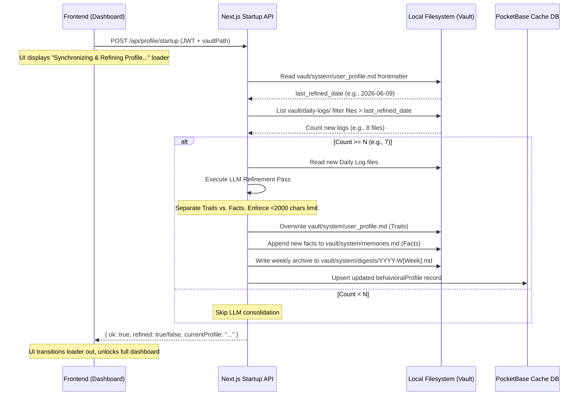

# Unified Memory & Profile Synthesis Architecture

This document defines the unified memory engine and context consolidation architecture for Dialogue. It details how the system splits static knowledge from behavioral instructions, manages the filesystem-backed memory stores, runs app-start consolidation, and integrates the dual-graph retrieval model (logical SQLite walker + semantic Mastra GraphRAG).

---

## 1. Core Concept: The Memory Split

To ensure the agent behaves consistently, avoids context window bloat, and preserves user privacy, Dialogue splits memory into two distinct operational layers:

```
                            ┌────────────────────────────────────────┐
                            │          Your Markdown Vault           │
                            │      (Tasks, Events, Habits, Notes)    │
                            └───────────────────┬────────────────────┘
                                                │
                                                ▼ (Sync Engine watch)
                            ┌────────────────────────────────────────┐
                            │        PocketBase Database Cache       │
                            └─────────┬────────────────────┬─────────┘
                                      │                    │
          ┌───────────────────────────┘                    └───────────────────────────┐
          ▼ (Behavioral Profile)                                                       ▼ (Declarative Memory)
  ┌───────────────────────────────┐                                            ┌───────────────────────────────┐
  │        user_profile.md        │                                            │          memories.md          │
  ├───────────────────────────────┤                                            ├───────────────────────────────┤
  │ • Scope: Traits & Instructions│                                            │ • Scope: Static Facts & RAG   │
  │ • Loaded: Always on boot      │                                            │ • Loaded: Dynamically via RAG │
  │ • Limit: Strict 2,000 chars   │                                            │ • Limit: Scalable (no cap)    │
  │ • Ingestion: App-start LLM    │                                            │ • Ingestion: Real-time sync / │
  │   refinement from Daily Logs  │                                            │   tool calls / LLM delegation │
  └───────────────────────────────┘                                            └───────────────────────────────┘
```

### A. Behavioral Profile (`vault/system/user_profile.md`)
*   **Role**: Stores instructions, cognitive preferences, communication styles, and scheduling directives.
*   **Retrieval**: Always loaded directly into the system instructions on session startup to shape the agent's core personality and behavior.
*   **App Start Refinement**: Refined dynamically on app start by analyzing the past $N$ daily logs.
*   **Strict Character Limit**: Capped at **2,000 characters** (maximum 7 items). The refinement LLM is instructed to consolidate, rewrite, and prune traits to maintain the character cap, preventing system prompt bloat.

### B. Declarative Memory (`vault/system/memories.md`)
*   **Role**: Stores explicit factual knowledge (hobbies, project contexts, relationship links, name records).
*   **Retrieval**: Loaded dynamically into the conversation via Vector/Graph search (RAG) *only when relevant*.
*   **Archiving**: Scalable list of facts with no strict character cap, managed via vector embeddings.

> [!NOTE]
> **Deprecation of OCEAN**: Traditional psychometric scoring (OCEAN profiles) is deprecated in favor of this behavioral profile and Daily Log timeline synthesis.

---

## 2. Behavioral Profile Refinement (Daily Logs & App Startup)

Dialogue replaces abstract personality indexing with a concrete timeline of habits, reflections, and workspace activities.

### A. Divided Daily Log Structure
To preserve privacy and support zero-cloud folder sharing, the daily log is split into two specialized files:
1.  **Global Daily Log (`vault/daily-logs/YYYY-MM-DD.md`)**: Captures personal journal entries, habits, and global task/event activities.
2.  **Workspace Activity Log (`vault/workspaces/[Workspace-Name]/activity/YYYY-MM-DD.md`)**: Tracks technical work logs, tool execution traces, playbooks, and tasks specific to that workspace.

### B. Refinement Pipeline
Dialogue refines the user's behavioral profile on a deterministic schedule driven by a startup catch-up pipeline:

1.  **Configurable Threshold ($N$)**: The user defines a preference parameter, $N$ (defaulting to `7` daily logs).
2.  **App Start Catch-up**: When Dialogue boots, it enters a brief initialization phase. The sync engine counts the number of daily log files created since the last profile refinement.
    *   During this catch-up phase, the UI displays a **"Synchronizing and Refining Profile"** loader state before showing the main workspace as fully ready.
3.  **Refinement Run**: If $\text{count} \ge N$:
    *   The agent runs a synthesis pass over the $N$ new daily logs.
    *   **Writes Active Profile (`user_profile.md`)**: It overwrites `vault/system/user_profile.md` with the updated N-Line Startup Profile under a strict 2,000-character limit.
    *   **Delegates Facts**: Static facts (e.g. tech stacks, hobbies) are extracted and written to `vault/system/memories.md` instead.
    *   **Archives Digest**: It compiles a historical Markdown digest and saves it under `vault/system/digests/YYYY-W[Week].md` (e.g., `2026-W23.md`), preserving a read-only archive of the user's weekly behavior.

#### Profile Refinement LLM Directives
When refining the profile, the agent executes a structured prompt using the user's selected primary LLM. The prompt enforces separation of traits and facts while guaranteeing the character budget is respected:

```markdown
You are a context consolidation agent. Your task is to update the user's behavioral profile using a set of new Daily Logs.

Inputs:
1. Current Profile (vault/system/user_profile.md)
2. New Daily Logs (past N days)

Rules:
1. TARGET BEHAVIOR: Focus exclusively on behavioral traits, working style preferences, stress responses, scheduling habits, and communication desires.
2. EXCLUDE STATIC FACTS: Do not include hobbies, project names, technical stacks, or life facts (e.g., "likes green tea", "working on Dialogue-AI project", "has a cat"). Output these as a separate list of facts so they can be written to memories.md.
3. STRICT CHARACTER LIMIT: The updated profile must NOT exceed 2,000 characters. Keep it under 7 high-density items. Merge overlapping traits. Prune old/deprecated habits if new ones override them.
4. FORMAT: Output the new profile in clean Markdown starting with a metadata frontmatter block.

Output Schema:
{
  "updatedProfile": "---yaml\nlast_refined_date: YYYY-MM-DD\ntotal_refinements: X\n---\n\n# User Profile & Startup Context...\n",
  "extractedFacts": [
    "User prefers coding in Rust on weekends.",
    "User started a new workspace named Dialogue-App."
  ]
}
```

#### Startup Catch-up Flow Sequence
The startup check and consolidation sequence runs during Next.js app initialization:



---

## 3. Transparent & Auditable Declarative Memory

Because the source of truth for declarative memory is a physical Markdown file on the user's disk (`vault/system/memories.md`), the user has total visibility and control:

*   **Deletion**: If the user wants the agent to "forget" a fact, they open `memories.md` and delete the corresponding bullet point. The file watcher detects the delete and removes the embedding from the database cache.
*   **Correction**: If the agent makes a false assumption, the user edits the line in `memories.md`, and the agent's memory updates instantly.

### A. Memory Scopes
1.  **Unified (Workspace-Agnostic) Memories (`vault/system/memories.md`)**: Global profile facts, interpersonal preferences, and communication style, accessible in any conversation.
2.  **Specialized (Workspace-Specific) Memories (`vault/workspaces/[Workspace-Name]/workspace_memories.md`)**: Technical details, project constraints, client relationships, or credentials relevant only to that workspace.
    *   When working within a specific workspace, the agent loads **both** the Unified memories and the workspace's Specialized memories.
    *   If no workspace is active (general chat), specialized memories are completely isolated.

### B. Memory Presence (Time-Decay & Deduplication)
To prevent the agent's memory from feeling static or repetitive, the retrieval engine applies two ranking filters:

#### Time-Decay (Recency Weighting)
Matches are scored using a combined weight of semantic similarity and age:
$$\text{Final Score} = \text{Cosine Similarity} \times e^{-\lambda t}$$
where $t$ is the number of days since the memory/note was last modified, and $\lambda$ is a decay coefficient (default: `0.05` for gradual decay). This ensures recent notes and events naturally prioritize in context.

#### Semantic Deduplication
If the agent retrieves top $K$ memories, it checks similarity *between the retrieved results themselves*. If any two retrieved memories have a mutual similarity score exceeding `0.80`, the system keeps only the most recent or highest-scoring memory, discarding the redundant duplicate.

---

## 4. Hybrid Graph & RAG Architecture

Dialogue utilizes a **Hybrid Graph Architecture** in SQLite to parse and query structured task dependencies and semantic connections simultaneously.

### A. Dialogue Vault Graph (Logical Edges)
*   **Declaration**: Links are written explicitly in the vault Markdown files (e.g. `blocked_by: [task-123]`, `mentions: [note-456]`, or inline wiki-links `[[note-456]]`).
*   **Parsing**: The sync engine's AST parser extracts these links during file watches and writes them to the `graph_edges` table:
  ```sql
  CREATE TABLE graph_edges (
    id TEXT PRIMARY KEY,
    user TEXT REFERENCES users(id),
    from_mem TEXT, -- Source entity/memory ID
    to_id TEXT,    -- Target entity ID
    target_type TEXT, -- 'Task' | 'Event' | 'Habit' | 'Note'
    edge_type TEXT    -- 'MENTIONS_TASK' | 'BLOCKED_BY' etc.
  );
  ```

### B. Mastra GraphRAG (Semantic Edges)
*   **Declaration**: Built **in-memory at query time** by Mastra from vector embeddings (384d Xenova model) stored in the `memories` table.
*   **Graph Construction**: Mastra queries the vector cache to get relevant chunks, computes cosine similarity between all pairs of retrieved chunks, and draws a semantic edge if the similarity exceeds `threshold` (default `0.7`).

### C. Retrieval & Traversal Algorithms
When the user queries the agent, the system exposes two specialized tools to the Mastra agent:

1.  **The Custom Graph Walker (Structured Tool)**:
    *   Used for queries about scheduling, dependencies, and exact file scopes.
    *   Performs a Breadth-First Search (BFS) starting from the active task/event scope or vector-matched seeds.
    *   Traverses up to 3 hops in a single recursive CTE query:
      ```sql
      WITH RECURSIVE graph_walk(id, depth) AS (
          SELECT target_id, 0 FROM seeds
          UNION ALL
          SELECT e.to_id, gw.depth + 1
          FROM graph_edges e
          JOIN graph_walk gw ON e.from_mem = gw.id
          WHERE gw.depth < 3
      )
      SELECT DISTINCT id, depth FROM graph_walk;
      ```
    *   Applies score decay based on distance.

2.  **The Mastra GraphRAG Tool (Semantic Tool)**:
    *   Used for open-ended conceptual research across notes and summaries.
    *   Runs a **Random Walk with Restart (RWR)** algorithm on the similarity graph:
        1. Starts at the node closest to the user's query embedding.
        2. Walks to neighboring nodes based on edge weights (similarity scores).
        3. Has a fixed probability (e.g. `restartProb = 0.15`) of restarting from the query node on each step.

---

## 5. Key Design Decisions

1.  **No Separate Graph Database**: We avoid Neo4j or other heavy services. SQLite handles logical edges via CTEs, and Mastra handles semantic GraphRAG in-memory. This preserves Dialogue's single-binary, offline-first execution model.
2.  **Filesystem as Authority**: Both graph representations are derived from raw `.md` files. If the user edits `memories.md` or note wiki-links, the sync engine updates the database cache accordingly.
3.  **Decoupled Search**: By providing the agent with both tools (`getTaskGraph` and `graphQueryTool`), we let the LLM dynamically decide whether a query requires logical dependency parsing or conceptual semantic walking.
