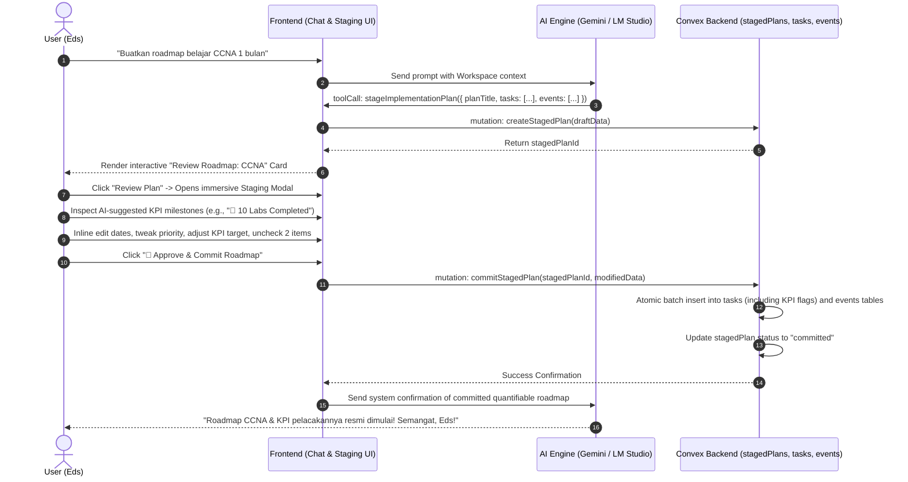

# Batch & Complex Planning with KPI Synergy (Roadmap Staging)

## 📖 Overview

When users request complex, multi-step roadmaps (e.g., *"Buatkan rencana belajar sertifikasi CCNA selama 1 bulan"* or *"Siapkan peluncuran produk e-commerce dalam 2 minggu"*), executing 20+ individual tool calls (`addTask` or `addEvent`) in a single turn is highly inefficient. It floods the chat history, hits AI rate limits, and robs the user of the opportunity to review the overall strategy before cluttering their workspace.

**Batch & Complex Planning** introduces an interactive **Staging Architecture**. The AI generates a structured, multi-item roadmap draft (`stageImplementationPlan`). Crucially, this staging engine operates hand-in-hand with **KPI Tracking**. The AI automatically designates pivotal roadmap milestones as quantifiable Key Performance Indicators (KPIs). The frontend renders an immersive, malleable staging overlay where the user can inspect, tweak, reorder, adjust KPI targets, or uncheck individual items before committing the entire quantifiable roadmap in a single atomic database transaction.

---

## 🏗️ Architectural Workflow



---

## 🗄️ Backend Schema (`convex/schema.ts`)

We introduce a dedicated table for storing draft roadmaps complete with KPI metric configurations to ensure seamless integration into the goal-tracking engine upon commitment.

```typescript
stagedPlans: defineTable({
  userId: v.id("users"),
  workspaceId: v.optional(v.id("workspaces")),
  title: v.string(),
  description: v.optional(v.string()),
  status: v.union(v.literal("draft"), v.literal("committed"), v.literal("discarded")),
  proposedTasks: v.array(v.object({
    id: v.string(), // Temporary uuid for staging UI
    text: v.string(),
    priority: v.union(v.literal("low"), v.literal("medium"), v.literal("high")),
    category: v.string(),
    dueDateOffsetDays: v.optional(v.number()), // Relative to approval date
    estimatedMinutes: v.optional(v.number()),
    selected: v.boolean(), // Checkbox state in Staging UI
    // KPI Synergy Fields
    isKpi: v.optional(v.boolean()),
    kpiType: v.optional(v.union(v.literal("percentage"), v.literal("numeric"), v.literal("boolean"))),
    kpiTarget: v.optional(v.number()),
    kpiUnit: v.optional(v.string()), // e.g., "labs", "pages", "commits"
  })),
  proposedEvents: v.array(v.object({
    id: v.string(),
    title: v.string(),
    description: v.optional(v.string()),
    startTimeOffsetDays: v.number(),
    startTimeHourOfDay: v.string(), // "09:00"
    durationMinutes: v.optional(v.number()),
    eventType: v.union(v.literal("interval"), v.literal("point")),
    selected: v.boolean(),
  })),
  createdAt: v.number(),
  committedAt: v.optional(v.number()),
}).index("by_user_status", ["userId", "status"]),
```

---

## 🤖 AI Tool Schema (`stageImplementationPlan`)

### Tool Definition

```typescript
{
  name: "stageImplementationPlan",
  description: "Generates a multi-step roadmap containing multiple tasks and events for complex projects or learning goals. Critical: Identifies pivotal milestones as quantifiable KPIs. This does NOT add items directly to the user's list. It creates an interactive staging area for review.",
  parameters: {
    type: SchemaType.OBJECT,
    properties: {
      title: { type: SchemaType.STRING, description: "Roadmap title (e.g. '1-Month CCNA Roadmap')" },
      description: { type: SchemaType.STRING, description: "Executive summary of the roadmap strategy" },
      tasks: {
        type: SchemaType.ARRAY,
        items: {
          type: SchemaType.OBJECT,
          properties: {
            text: { type: SchemaType.STRING },
            priority: { type: SchemaType.STRING, description: "'low', 'medium', or 'high'" },
            category: { type: SchemaType.STRING },
            dueDateOffsetDays: { type: SchemaType.NUMBER, description: "Days from today when due" },
            isKpi: { type: SchemaType.BOOLEAN, description: "Set to true if this task is a pivotal milestone metric" },
            kpiType: { type: SchemaType.STRING, description: "'percentage', 'numeric', or 'boolean'" },
            kpiTarget: { type: SchemaType.NUMBER, description: "Goal value (e.g., 100 for %, 10 for 10 labs)" },
            kpiUnit: { type: SchemaType.STRING, description: "Unit of measurement (e.g., 'labs', 'chapters')" }
          },
          required: ["text", "priority", "category"]
        }
      },
      events: {
        type: SchemaType.ARRAY,
        items: {
          type: SchemaType.OBJECT,
          properties: {
            title: { type: SchemaType.STRING },
            startTimeOffsetDays: { type: SchemaType.NUMBER },
            startTimeHourOfDay: { type: SchemaType.STRING, description: "24-hour HH:mm string (e.g. '10:00')" },
            durationMinutes: { type: SchemaType.NUMBER },
            eventType: { type: SchemaType.STRING, description: "'interval' or 'point'" }
          },
          required: ["title", "startTimeOffsetDays", "startTimeHourOfDay", "eventType"]
        }
      }
    },
    required: ["title", "tasks"]
  }
}
```

---

## 🖥️ Malleable GUI & UX Design

### 1. In-Chat Staging Card (`StagedPlanCard.tsx`)

- **Visuals**: `#8b5cf6/10` background with a glowing pulsing border.
- **Content**: Roadmap title, milestone count, and KPI summary (e.g., *15 Tasks & 3 KPI Milestones Staged*).
- **Interactive Trigger**: A prominent **"🔍 Review Roadmap & KPIs"** button.

### 2. Immersive Staging Overlay (`PlanReviewModal.tsx`)

- **Header**: Roadmap title, estimated duration, and view toggle.
- **Interactive List**:
  - Regular items feature standard checkboxes and date shifters.
  - KPI Items stand out with a glowing gold **"🎯 KPI Milestone"** badge. Users can click the badge to inline-edit the metric target or unit before committing.
- **Footer Controls**: Premium **"🚀 Approve & Commit Roadmap"** button with glowing animated gradient.

---

## ⚡ Backend Batch Mutation (`commitStagedPlan`)

When the user clicks commit, the server calculates absolute timestamps based on `Date.now()` and performs an atomic transaction that commits both standard tasks and KPI configurations:

```typescript
export const commitStagedPlan = mutation({
  args: { stagedPlanId: v.id("stagedPlans"), modifiedTasks: v.any(), modifiedEvents: v.any() },
  handler: async (ctx, args) => {
    const plan = await ctx.db.get(args.stagedPlanId);
    if (!plan || plan.status !== "draft") throw new Error("Invalid plan");

    const now = Date.now();
    const oneDayMs = 86400000;

    // 1. Batch Insert Tasks with KPI flags
    for (const t of args.modifiedTasks) {
      if (!t.selected) continue;
      const dueDate = t.dueDateOffsetDays !== undefined ? now + (t.dueDateOffsetDays * oneDayMs) : undefined;
      await ctx.db.insert("tasks", {
        userId: plan.userId,
        workspaceId: plan.workspaceId,
        text: t.text,
        priority: t.priority,
        category: t.category,
        dueDate,
        completed: false,
        createdAt: now,
        isKpi: t.isKpi || false,
        kpiType: t.kpiType,
        kpiTarget: t.kpiTarget,
        kpiCurrent: t.isKpi ? 0 : undefined,
        kpiUnit: t.kpiUnit,
      });
    }

    // 2. Batch Insert Events
    for (const e of args.modifiedEvents) {
      if (!e.selected) continue;
      const baseDate = new Date(now + (e.startTimeOffsetDays * oneDayMs));
      const [hours, minutes] = e.startTimeHourOfDay.split(":").map(Number);
      baseDate.setHours(hours, minutes, 0, 0);
      const startTime = baseDate.getTime();
      const endTime = e.durationMinutes ? startTime + (e.durationMinutes * 60000) : undefined;

      await ctx.db.insert("events", {
        userId: plan.userId,
        workspaceId: plan.workspaceId,
        title: e.title,
        description: e.description,
        startTime,
        endTime,
        eventType: e.eventType,
      });
    }

    // 3. Mark Plan as Committed
    await ctx.db.patch(args.stagedPlanId, { status: "committed", committedAt: now });
  }
});
```
